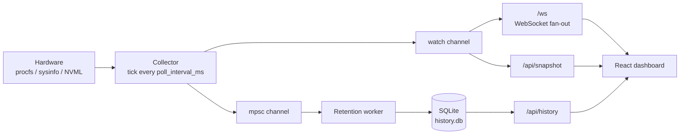

<div align="center">

# ResourceWatch

**Real-time system resource monitoring with a single-binary web dashboard.**

Rust + Axum backend streaming live CPU, RAM, GPU, disk, network, temperature and
battery metrics over WebSocket to a React dashboard — with persistent history in
SQLite and zero external services.

[](https://github.com/frammawiliansyah/resourcewatch/actions/workflows/ci.yml)
[](LICENSE)
[](https://www.rust-lang.org/)

</div>

---

## Why ResourceWatch

Most monitoring stacks want a time-series database, an agent, and a dashboard
service. ResourceWatch is one ~7 MB binary that serves its own dashboard and
writes history to a local SQLite file.

- **No dependencies to operate** — no Prometheus, no Grafana, no Docker required.
- **One port, one process** — the release binary serves the REST API, the
  WebSocket stream, and the compiled frontend together.
- **Degrades gracefully** — missing GPU, sensors, or battery are reported as
  unavailable rather than crashing the service.
- **Honest resource usage** — an idle collector tick is cheap enough to run
  continuously on a laptop or a small VPS.

## Features

| | |
|---|---|
| **Live streaming** | WebSocket (`/ws`) push on every collector tick (default 1s) |
| **CPU** | Aggregate + per-core utilisation, package temperature |
| **Memory** | RAM and swap used/total/available |
| **GPU** | NVIDIA via NVML — utilisation, VRAM, temperature, power draw, fan |
| **Storage** | Per-mount capacity and usage |
| **Disk I/O** | Read/write throughput per second |
| **Network** | Per-interface RX/TX throughput |
| **Battery** | Charge percentage and charging status |
| **Processes** | Top processes by CPU and memory |
| **History** | SQLite-backed range queries with configurable retention |

## Requirements

- **Rust** toolchain (2024 edition) — install via [rustup](https://rustup.rs)
- **Node.js** v18+ and npm
- **Linux** (primary target) or **macOS**
- *Optional:* NVIDIA driver for GPU metrics; `lm-sensors` on Linux for
  temperature readings

---

## Quick start

```bash
git clone https://github.com/frammawiliansyah/resourcewatch.git
cd resourcewatch
sudo ./deploy/install.sh          # Linux
# ./deploy/install.sh             # macOS — no sudo
```

The installer checks prerequisites, builds the binary and frontend, installs
them, and registers a background service that starts on boot. When it finishes,
open **http://localhost:8090**.

### Installer options

```bash
./deploy/install.sh --port 10001            # listen on a different port
./deploy/install.sh --prefix /srv/rw        # custom install directory
./deploy/install.sh --no-service            # build and install files only
./deploy/install.sh --uninstall             # stop and remove the service
```

| Platform | Service | Install prefix |
|---|---|---|
| Linux | systemd unit `resourcewatch`, dedicated unprivileged user | `/opt/resourcewatch` |
| macOS | launchd agent `io.resourcewatch.agent` (per-user, no root) | `~/.local/share/resourcewatch` |

Re-running the installer upgrades an existing installation. Your `config.toml`
is never overwritten — the new defaults are written to `config.toml.new`.

### Managing the service

<details>
<summary><b>Linux (systemd)</b></summary>

```bash
sudo systemctl status resourcewatch
sudo systemctl restart resourcewatch
sudo systemctl stop resourcewatch
journalctl -u resourcewatch -f
```
</details>

<details>
<summary><b>macOS (launchd)</b></summary>

```bash
launchctl list | grep io.resourcewatch.agent
launchctl kickstart -k "gui/$UID/io.resourcewatch.agent"   # restart
launchctl unload ~/Library/LaunchAgents/io.resourcewatch.agent.plist
tail -f ~/.local/share/resourcewatch/logs/resourcewatch.log
```
</details>

---

## Configuration

Settings resolve in order of increasing precedence:
**built-in defaults → `config.toml` → environment variables**.

```toml
[server]
bind_addr = "0.0.0.0"        # use "127.0.0.1" to restrict to localhost
port = 8090

[polling]
poll_interval_ms = 1000      # live metric tick rate
history_interval_secs = 10   # how often a snapshot is persisted

[retention]
retention_days = 3           # history older than this is deleted
cleanup_interval_secs = 3600 # how often the cleanup worker runs

[database]
path = "data/history.db"

[frontend]
static_dir = "frontend/dist"
```

Every setting has an environment variable override, which is what the systemd
unit and launchd agent use:

| Variable | Overrides | Default |
|---|---|---|
| `RW_CONFIG_PATH` | Path to the config file itself | `config.toml` |
| `RW_BIND_ADDR` | `server.bind_addr` | `0.0.0.0` |
| `RW_PORT` | `server.port` | `8090` |
| `RW_POLL_INTERVAL_MS` | `polling.poll_interval_ms` | `1000` |
| `RW_HISTORY_INTERVAL_SECS` | `polling.history_interval_secs` | `10` |
| `RW_RETENTION_DAYS` | `retention.retention_days` | `3` |
| `RW_CLEANUP_INTERVAL_SECS` | `retention.cleanup_interval_secs` | `3600` |
| `RW_DB_PATH` | `database.path` | `data/history.db` |
| `RW_STATIC_DIR` | `frontend.static_dir` | `frontend/dist` |
| `RUST_LOG` | Log verbosity (`error`/`warn`/`info`/`debug`/`trace`) | `info` |

> [!WARNING]
> ResourceWatch has **no built-in authentication** and exposes process names and
> hardware details. The default `bind_addr` listens on all interfaces. On any
> untrusted network, bind to `127.0.0.1`, or place it behind a reverse proxy
> that handles TLS and auth. See [SECURITY.md](SECURITY.md).

---

## API reference

| Endpoint | Method | Description |
|---|---|---|
| `/api/health` | `GET` | Status, version, uptime in seconds |
| `/api/config` | `GET` | Effective runtime config and GPU availability |
| `/api/snapshot` | `GET` | Latest full metric snapshot |
| `/api/history` | `GET` | Historical series — see parameters below |
| `/ws` | `WS` | Live snapshot stream, one JSON message per tick |

### `GET /api/history`

| Parameter | Required | Description |
|---|---|---|
| `metric` | yes | `cpu`, `ram`, `gpu`, `network`, `diskio`, `storage`, `temperature`, `battery` |
| `range` | no | `15m`, `1h`, `6h`, `24h`, `3d` (default `1h`) |
| `from` / `to` | no | Explicit Unix millisecond bounds; overrides `range` |
| `mount` | no | Filter `storage` to a specific mount point |
| `iface` | no | Filter `network` to a specific interface |

```bash
curl 'http://localhost:8090/api/history?metric=cpu&range=6h'
curl 'http://localhost:8090/api/history?metric=storage&mount=/'
```

Requesting `metric=storage` without `mount` returns the list of available mount
points instead of a series.

---

## Development

```bash
./scripts/dev.sh start     # backend :8090 + Vite HMR :5173
./scripts/dev.sh logs      # tail both processes
./scripts/dev.sh status
./scripts/dev.sh stop
```

Open **http://localhost:5173** — Vite proxies `/api` and `/ws` to the backend,
so the frontend hot-reloads against live metrics.

<details>
<summary>Manual setup</summary>

```bash
cargo run                                   # backend
cd frontend && npm install && npm run dev   # frontend
```
</details>

### Production build without the installer

`scripts/prod.sh` builds and runs the release binary directly. If the systemd
unit is installed it transparently delegates to `systemctl`.

```bash
./scripts/prod.sh build
./scripts/prod.sh start -p 10001
./scripts/prod.sh status
./scripts/prod.sh logs
./scripts/prod.sh stop
```

---

## Architecture



A single collector task polls the hardware and publishes each snapshot to a
`watch` channel, so any number of WebSocket clients share one collection pass.
Every *n*th snapshot is forwarded to the retention worker, which writes it to
SQLite and periodically prunes rows past the retention window.

### Project layout

```
resourcewatch/
├── src/
│   ├── api/            # REST handlers + WebSocket stream
│   ├── db/             # SQLite schema, inserts, history queries
│   ├── metrics/        # One collector module per metric family
│   ├── config.rs       # Config file + env override resolution
│   ├── retention.rs    # History writer & cleanup worker
│   └── main.rs
├── frontend/           # React 19 + TypeScript + Vite + Tailwind v4
├── deploy/
│   ├── install.sh      # One-time cross-platform setup
│   ├── systemd/        # Linux service unit
│   └── launchd/        # macOS agent template
├── scripts/
│   ├── dev.sh          # Dev runner (backend + Vite HMR)
│   └── prod.sh         # Production build & process management
└── config.toml
```

### Tech stack

**Backend** — Rust 2024, Tokio, Axum, sysinfo, nvml-wrapper, rusqlite (bundled
SQLite), tower-http
**Frontend** — React 19, TypeScript, Vite, Tailwind CSS v4, uPlot, Lucide

---

## Troubleshooting

<details>
<summary><b>GPU metrics show as unavailable</b></summary>

NVML only supports NVIDIA GPUs. Verify the driver works with `nvidia-smi`. If
that succeeds but the service still reports no GPU, the dedicated
`resourcewatch` user likely cannot read `/dev/nvidia*` — check ownership with
`ls -l /dev/nvidia0` and uncomment `SupplementaryGroups=video` in
`/etc/systemd/system/resourcewatch.service`, then
`sudo systemctl daemon-reload && sudo systemctl restart resourcewatch`.
</details>

<details>
<summary><b>No temperature readings</b></summary>

On Linux install and configure `lm-sensors` (`sudo apt install lm-sensors &&
sudo sensors-detect`). Inside containers and most VMs no sensors are exposed at
all. macOS does not expose CPU temperature without elevated privileges.
</details>

<details>
<summary><b>Port already in use</b></summary>

Reinstall with a different port (`sudo ./deploy/install.sh --port 10001`), or
set `Environment=RW_PORT=10001` in the unit file and restart.
</details>

<details>
<summary><b>History charts are empty</b></summary>

Snapshots are only written every `history_interval_secs` (default 10s), so a
freshly started instance has nothing to plot yet. Data older than
`retention_days` is deleted permanently.
</details>

---

## Contributing

Contributions are welcome — see [CONTRIBUTING.md](CONTRIBUTING.md) for the
development workflow, the checks to run before a PR, and a walkthrough of adding
a new metric.

## License

[MIT](LICENSE) © Framma Wiliansyah
